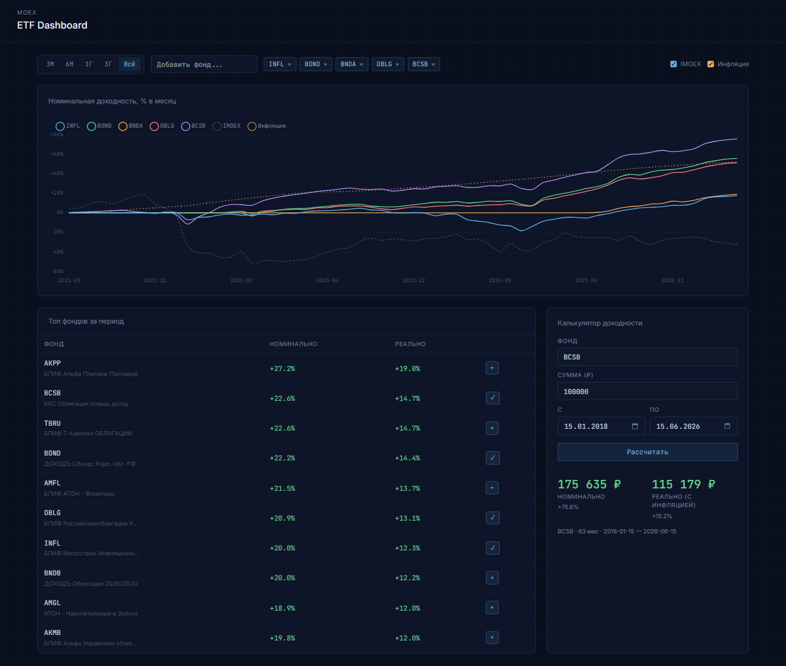
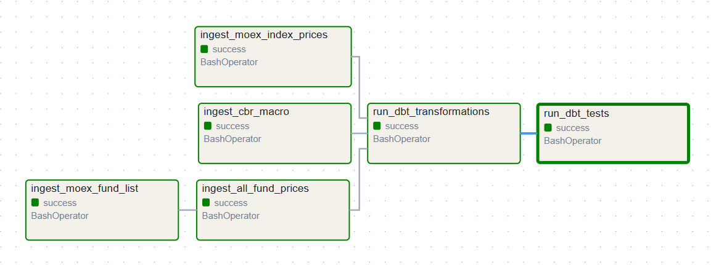

# MOEX ETF Analytics

Portfolio project: dashboard and calculator for comparing Russian mutual funds (БПИФы) against inflation and the MOEX index, with a full ELT pipeline behind it.



Pick a fund, a period, and an amount — get nominal return, real return adjusted for CPI, and how it stacks up against IMOEX.

## Architecture

```
MOEX ISS API + CBR SOAP API
        │
        ▼
Airflow (daily)
  ├── ingestion/moex.py  → raw.fund_info, raw.fund_prices, raw.index_prices
  └── ingestion/cbr.py   → raw.cbr_macro
        │
        ▼
dbt
  ├── staging  → casting, dedup
  └── mart     → fct_fund_monthly_performance
        │
        ▼
PostgreSQL (etf_db)
  ├── FastAPI + Jinja2 → dashboard on :8000
  └── Airflow UI       → :8080

Docker Compose — all services
Terraform      — VM provisioning (Yandex Cloud)
```



**Schemas:** `raw` holds data as received from the APIs (everything TEXT, no dedup). `analytics` staging casts types and dedupes. `analytics` mart has one table, `fct_fund_monthly_performance` — monthly nominal/real return, alpha vs IMOEX.

## Stack

Python ingestion · Airflow 2.10 · PostgreSQL 15 · dbt Core 1.8 · FastAPI · vanilla JS + Chart.js + Tailwind · Docker Compose · Terraform  · GitHub Actions CI/CD

## Data sources

- [MOEX ISS API](https://iss.moex.com/iss/reference/) — fund prices (TQTF board), IMOEX, fund metadata. Free, no auth.
- [CBR SOAP API](https://www.cbr.ru/secinfo/secinfo.asmx) — monthly inflation (YoY) and key rate, `InflationXML` method.

Funds reinvest dividends automatically, so price alone captures total return — no separate dividend handling needed. Real return uses the Fisher equation with monthly inflation derived from the YoY figure: `(1 + r)^(1/12) - 1`.

## Project structure

```
moex-fund-compare/
├── ingestion/
│   ├── moex.py
│   ├── cbr.py
│   ├── fetch_all_prices.py
│   └── tests/
│       └── test_smoke.py
├── dbt/
│   └── models/{staging,mart}/
├── airflow/dags/moex_analytics.py
├── api/
│   ├── main.py
│   └── templates/index.html
├── infra/
│   ├── bootstrap.sh
│   ├── Dockerfile.airflow
│   ├── Dockerfile.api
│   ├── sql/
│   └── terraform/
├── docker-compose.yml
├── .env.example
└── .github
    └── workflows/
        └── deploy.yaml

```

## Running locally

```bash
git clone https://github.com/stubchief/moex-fund-compare
cd moex-fund-compare
cp .env.example .env
mkdir -p airflow/dags
docker compose up --build
```

- Dashboard: http://localhost:8000
- Airflow: http://localhost:8080 (admin / admin)

Trigger the pipeline manually if you don't want to wait for the daily schedule:

```bash
docker compose exec airflow-webserver airflow dags unpause moex_etf_pipeline
docker compose exec airflow-webserver airflow dags trigger moex_etf_pipeline
```

`.env` needed for local use:

```bash
POSTGRES_USER=airflow
POSTGRES_PASSWORD=airflow
POSTGRES_DB=airflow_db
AIRFLOW_UID=50000
```

## Deployment

Terraform provisions a single VM on Yandex Cloud and via `cloud-init` runs the first deploy.
State is stored remotely in Yandex Object Storage.

### One-time setup

1. Create a Yandex Object Storage bucket for Terraform state (private, versioning enabled).

2. Run bootstrap to create a Terraform service account:
```bash
   bash infra/bootstrap.sh
```

3. Create a static access key for the service account in the Yandex Cloud console
   (IAM → Service accounts → terraform-sa → Static access keys).

4. Add the following secrets to the GitHub repository
   (Settings → Secrets and variables → Actions):

   | Secret | Description |
   |---|---|
   | `YC_KEY_JSON` | Contents of `infra/terraform/key.json` |
   | `YC_FOLDER_ID` | Yandex Cloud folder ID |
   | `SSH_PRIVATE_KEY` | Private SSH key (for VM access) |
   | `AWS_ACCESS_KEY_ID` | Object Storage static key ID (Terraform state) |
   | `AWS_SECRET_ACCESS_KEY` | Object Storage static key secret |
   | `TF_VAR_postgres_password` | PostgreSQL password |

### Running

Deployment is triggered manually via GitHub Actions (`workflow_dispatch`):
- runs smoke tests against live APIs
- lints with ruff
- runs `terraform apply`
- SSHes into the VM and runs `docker compose up --build -d`

`vm_external_ip` is printed as a Terraform output and visible in the Actions log.
Dashboard at `:8000`, Airflow at `:8080`.

To provision manually without CI/CD:
```bash
set -a; source .env; set +a
terraform -chdir=infra/terraform init
terraform -chdir=infra/terraform apply
```

## API

| Method | Path | Description |
|---|---|---|
| GET | `/` | Dashboard |
| GET | `/api/funds` | Fund reference list |
| GET | `/api/top-funds` | Top N by real return (`?months=12&limit=10`) |
| GET | `/api/performance` | Monthly series for tickers (`?tickers=SBMX,AKGD&from=...&to=...`) |
| GET | `/api/calculator` | Investment calculator (`?ticker=SBMX&amount=100000&from=...&to=...`) |

Docs at `/docs`.

## Notes on a few choices

- **Postgres, not ClickHouse** — ~100 funds × ~1500 trading days doesn't need a columnar store.
- **Compose, not k8s** — single node, no scaling need.
- **raw stores TEXT** — casting and dedup happen in dbt staging, so raw stays a safe, idempotent source of truth.